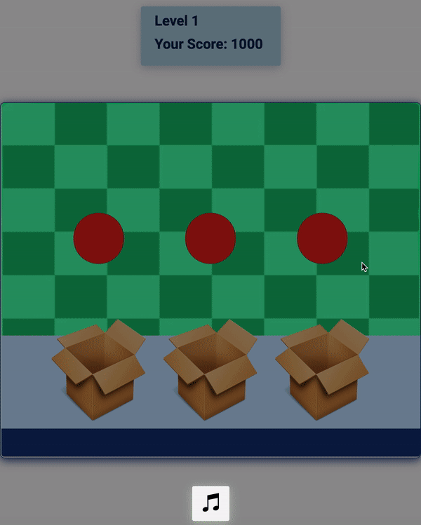

# Balls & Boxes
Balls & Boxes is a fun and challenging memory game. The balls are going to be shuffled, and your task to remember their original positions. How many swaps can you recall?

## Some Key Features
* Utilized PlainDraggable to allow seamless interaction with the 3 red balls.
* JavaScript & CSS transform to create elegant swapping animations.
* A level generator dynamically generates a potentially infinite quantity of unique new puzzles and adds difficulty with each successive win.

### Level Generating Algorithm

```javascript  
export const createLevel = (steps) => {
    // Instructions are fed to the swapBalls algorithm
    // Instructions are organized in pairs
    // Each pair gets swapped during game play

    // Example: 
    // instructions: [   
    //     [first_draggable_ball, second_draggable_ball],
    //     [second_draggable_ball, third_draggable_ball]
    // ]

    // When the example above is processed by the game, 
    // The following swaps take place: 
    // 1. The ball on the left (first_draggable_ball) is swapped with the ball in the middle (second_draggable_ball)
    // 2. The ball in the middle (second_draggable_ball) is swapped with the ball on the right (third_draggable_ball)
    // "first", "second", and "third" refer to the positions of the balls as they appear on the page
    
    let level = {
        instructions: [],
    };
    
    
    for(let i = 0; i < steps; i++) {
        let firstIdIdx; 
        let secondIdIdx;
        
        while ((!firstIdIdx && !secondIdIdx) || firstIdIdx >= secondIdIdx) {
            firstIdIdx = getRandomInt(2); 
            secondIdIdx = getRandomInt(3)
        }
        
        level.instructions.push( 
            [ 
                Ids[firstIdIdx], 
                Ids[secondIdIdx] 
            ]
        ); 
    }

    //After the instructions array is generated, 
    //this function creates a finalPlacings Object
    //that maps the balls with their original positions.

    //Example: 
    // finalPlacings = {
    //     "first_draggable_ball": 3, 
    //     "second_draggable_ball": 1, 
    //     "third_draggable_ball": 2
    // };  

    // In the example above:
    // 1. The ball on the left, "first_draggable_ball", was originally on the right (spot # 3). 
    // 2. The ball in the middle, "second_draggable_ball", was originally on the left (spot # 1). 
    // 3. The ball in the right, "third_draggable_ball", was originally in the middle (spot # 2). 

    // When the object above is evaluated, 
    // The evaluatePlacings algorithm, located in game.js, 
    // compares the user's answers with the finalPlacings object.
    
    //This loop generates prepares the "placings" Array, which is used in the finalPlacings Object
    //to map the balls to their final placings, as described above.
    for(let i = 0; i < level.instructions.length; i++) {
        let firstBall = level.instructions[i][0];
        let secondBall = level.instructions[i][1];
    
        swap(firstBall, secondBall); 
    }
    
    level.finalPlacings = {
        "first_draggable_ball": initial[0], 
        "second_draggable_ball": initial[1], 
        "third_draggable_ball": initial[2]
    };  
    
    resetInitial(); 
    
    return level; 
}
```


## Swapping the Balls 
The following code is run every millisecond during the swapping process.

```javascript  
    let top = 0.1; 
    let left = 0; 
    let right = 0; 
    
    const frame = () => {
        if (top == 0) {
            clearInterval(interval);
        } else {
            //The position of the ball on the x-axis changes linearly, shifting 3 pixels every millisecond. 
            left += 3; 
            right += 3;
            //the position of the ball on the y-axis changes according to the formula y = sqrt(2rx - x^2),, which represents a semi circle 
            top = Math.sqrt( (2 * radius * left) - Math.pow(left, 2) );

            //the position of the balls is shifted using CSS transfrom
            firstBall.style.transform = `translate( ${ `${left}px, ${-top}px` } )`;
            secondBall.style.transform = `translate( ${ `${-right}px, ${-top}px` } )`;
        }
    }

    let interval = setInterval(frame, 1);
```
### Gameplay



### Music
Enjoy J.S. Bach's Goldberg Variations, proven* to enhance your focusing powers. Feel free to turn the music off by clicking the music icon.

*proven through experience